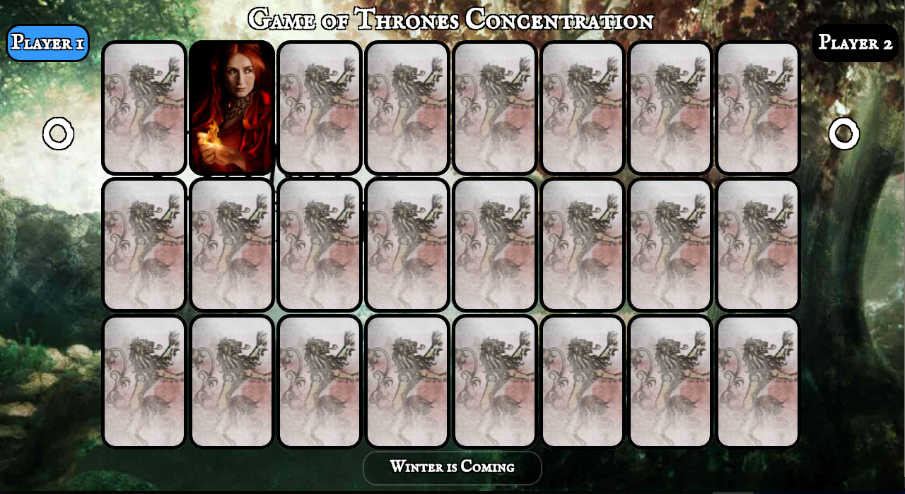

#Game of Thrones Concentration / Memory Game

###Rules:
Basic card matching memory game.
Find 2 matches get a point.
Player with most points wins.

###Design:
Mostly hard coded, should have used a For Loop instead of a click event listener on every card. I don't really understand object-oriented programing yet, so the code is way longer than it needs to be. The cards don't start out with pictures attatched, instead each picture is assigned to a class, the classes are shuffled in an array, and when a card is clicked it adds the class of a specific index in the array to that card.

###Languages used:
HTML: Simple layout with basic table.  I should have used Divs instead to make responsive design easier and to enable the cards to "flip".

CSS: Lots of layout design.  Images of cards and backgrounds assigned to classes.

Javascript: Only used Javascript when I didn't know the Jquery shortcut.

Jquery: Used almost exclusevly for DOM manipulation.

###Getting Started:
To play the game click the link above.  The game starts automatically, switching between players.  A "Play Again" button should appear after the game is over.  To edit the file, fork the repo and open in your favorite text editor.

##MVP: Minimum Viable Product

- Post website online
####DONE!!

- cards are placed randomly based on math
####DONE!!

- Card Pairs with various GOT characters
####DONE!!

- each pair is a point that gets added to player's score
####DONE!!

- cards flip over for at least a second, if a match is sucessfully found match disapears
####DONE!!

- 2 players, switches turns and lets user know whose turn it is
####DONE!!

- Player with most points wins or a tie is determined
####DONE!!

##ICEBOX: Extra Features

- sword cursor
####DONE!!

- fade in and fade out
####DONE!!

- "Play Again" buttons appears when game is finished
####DONE!!

- background changes randomly
####DONE!!

- added button to make it snow and remove snow
####DONE!!

- hover psuedo selector over each card that changes with player 1 or player 2
####DONE!!

- after all the cards are revealed the background is revealed.
####DONE!!

- better responsive design, doesn't look very good on a phone, cards are too small.

- a dradon card can be played that resuffles all the cards

- Countdown timer shuffles the remaining cards / or number of wrong picks / or after each wrong move a random pair of cards is moved with the cards moving visually

- can choose the back of the cards

- each game randomly selects which character cards will be played

- After each pair is found a Quote / piece of info of each character is displayed / sound effect of that character

- sound effects play when cards flip / a correct pair is found / an incorrect pair is found / when cards are dealt / when cards

- cards flip over with a jquery animation

- need to download each image, run them trough Photoshop *Save for Web* so the filesize is less

- need to link each image to a saved image file instead of linking to online images

- should figure out event bubbling so I don't have so many functions / such loooong functions

##Working on bugs:

- bug where if 2 cards are face up and user clicks on another before the first 2 disapear, the 3rd won't dissapear
####FIXED!!

- bug where if you click on the same picture twice the computer thinks a match is found
####FIXED!!

but now if user clicks on same image twice it switches turns.
####FIXED!!

- When the "snow effect" is on it can occasionally cause the game to not know when the game is over and may have to be reloaded.

